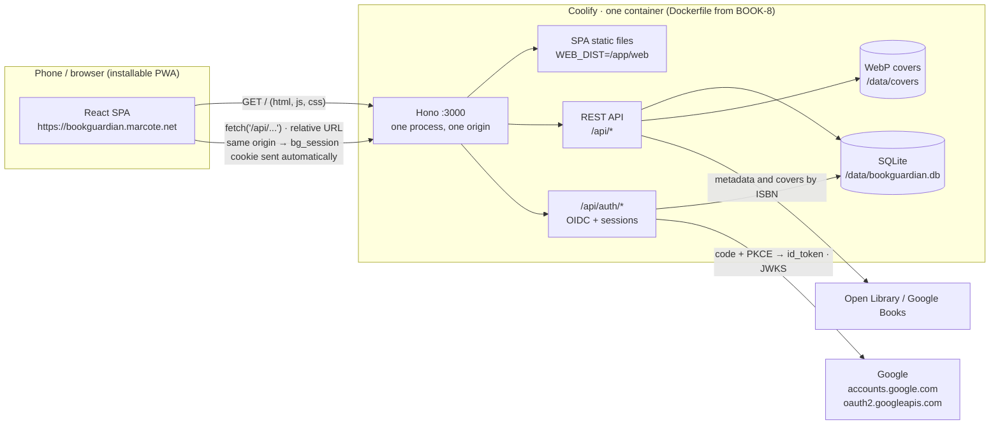

# Authentication: deployment, flow and security

How people sign in to Bookguardian (Google, OpenID Connect handled by the
API), how the SPA and the API talk to each other, and which parameter
protects against what. The decisions behind this are in
[ADR 0005](adr/0005-authentication.md); the tables are in
[data-model.md](data-model.md); the setup steps (Google Cloud client,
variables) are in the README, [Google sign-in](../README.md#google-sign-in).

## Deployment and front/back communication: one origin

Bookguardian does **not** follow the "front on one host, API on another"
pattern. Since BOOK-8 there is **one container** that serves the SPA (static
files from `apps/web/dist`) and the API under the same host; the SPA calls the
API with **relative** URLs (`fetch('/api/...')`), with no `VITE_API_URL` baked
into the build. For the browser everything is one origin: the session cookie
travels on its own, there is no CORS and no `credentials: 'include'`, and no
`api.` subdomain is needed.



What this means in practice:

- `AUTH_BASE_URL=https://bookguardian.marcote.net` is the origin of the SPA
  _and_ of the API. The redirect URI registered in Google Cloud is exactly
  `https://bookguardian.marcote.net/api/auth/google/callback`
  (`${AUTH_BASE_URL}/api/auth/google/callback`); the API logs it at boot.
- The `bg_session` cookie is **host-only** (no `Domain` attribute), `Path=/`.
  No other host ever receives it. The in-flight `bg_oauth` cookie is scoped
  even tighter, to `Path=/api/auth`.
- There is no `WEB_URL`, no CORS with credentials and no
  `credentials: 'include'`: the code assumes one origin. What separating the
  hosts would take is listed in ADR 0005 ("One origin"), not implemented.
- `pnpm dev` keeps the same model: Vite proxies `/api` to `localhost:3000`, so
  the browser only ever sees `localhost:5173` (set
  `AUTH_BASE_URL=http://localhost:5173` there). `vite preview` and the
  Playwright suite proxy the same way (`API_PROXY_TARGET`).

## Authentication flow

Steps 1–4 are the SPA: the guarded layout (`apps/web/src/routes/_app.tsx`)
asks `/api/auth/me` before the first screen renders and shows `/login`
(`apps/web/src/routes/login.tsx`) when there is no session; the API side is
steps 5 onwards.

```mermaid
sequenceDiagram
  autonumber
  participant B as Browser
  participant S as SPA (same URL)
  participant A as API Hono /api
  participant G as Google
  participant D as SQLite

  B->>S: opens /shelves/123 (no session)
  S->>A: GET /api/auth/me
  A-->>S: 401 unauthenticated
  S-->>B: shows /login (remembers return_to=/shelves/123)
  B->>A: GET /api/auth/google?return_to=/shelves/123
  A->>G: GET /.well-known/openid-configuration (cached in memory)
  A->>A: generates state, nonce, code_verifier (PKCE S256); return_to must be a relative path
  A-->>B: 302 accounts.google.com<br/>Set-Cookie bg_oauth (signed with AUTH_COOKIE_SECRET, httpOnly, Path=/api/auth, 10 min)
  B->>G: sign-in + consent (openid email profile)
  G-->>B: 302 /api/auth/google/callback?code=…&state=…
  B->>A: GET /api/auth/google/callback (cookie bg_oauth)
  A->>A: cookie signature ✔, state == cookie ✔ (else 400 invalid_state); bg_oauth cleared
  A->>G: POST token endpoint (code + code_verifier; client id:secret as HTTP Basic)
  G-->>A: id_token
  A->>G: JWKS (cached in memory)
  A->>A: signature, iss, aud, exp, nonce ✔ (else 400 oauth_error); email_verified ✔ (else 403)
  A->>D: resolveAccount: identity → email → claim local user → AUTH_ALLOWED_EMAILS → create (one transaction)
  A->>D: INSERT sessions (sha256(token), expires_at, last_seen_at, user_agent)
  A-->>B: 302 /shelves/123<br/>Set-Cookie bg_session=… httpOnly Secure SameSite=Lax Path=/ Max-Age=30d
  B->>A: GET /api/shelves/123 (cookie bg_session)
  A->>D: sessions WHERE token_hash = sha256(cookie); user
  A-->>B: 200 (ownerId = session.user_id); cookie re-issued when past the halfway point
```

Also on the API:

- `GET /api/auth/me` → `{ id, displayName, email, avatarUrl }` or
  `401 unauthenticated`.
- `POST /api/auth/logout` → deletes the `sessions` row and clears the cookie,
  `204`.
- Sessions slide: a request made with less than half the lifetime left pushes
  `expires_at` out by `AUTH_SESSION_DAYS` again and re-issues the cookie.
  Expired rows are purged on the daily maintenance timer (the one the cover GC
  uses).
- Without `GOOGLE_CLIENT_ID`/`GOOGLE_CLIENT_SECRET` the API boots but
  `/api/auth/google` (and the callback) answer `503 auth_not_configured`.
- `GET /api/auth/google` and the callback are browser navigations. When the
  request accepts HTML, a failure (`auth_not_configured`, `invalid_state`,
  `oauth_error`, `email_not_verified`, `not_allowed`) is a `302` to
  `/login?error=<code>&redirect=<return_to>` so the SPA can explain it and
  offer a retry; without `text/html` in `Accept` (fetch clients, tests) the
  JSON envelope is returned as for any other route.
- On the SPA, `/api/auth/me` is one TanStack Query: `null` (a 401) is a valid
  cached value that the route guard reads without a request; any other 401
  drops it and the shell navigates to `/login`. Sign-out `POST`s
  `/api/auth/logout`, empties the query cache and lands on `/login`.
- `POST /api/auth/test-login { email, name? }` signs in without Google. It is
  registered **only** when `NODE_ENV=test` (Playwright); anywhere else it is a
  404, and a test asserts that.

Account resolution (`apps/api/src/auth/account.ts`), in order, inside one
transaction:

1. `auth_identities(provider, subject)` known → that user (refresh
   `last_login_at`; fill avatar/name only if empty).
2. A user already has the (lower-cased) email → link the identity to it.
   Never a second user with the same email.
3. First sign-in ever (no identity anywhere) and exactly one email-less user
   (the pre-accounts local user) → **claim** it: email, name and avatar are set
   and its libraries stay where they are.
4. `AUTH_ALLOWED_EMAILS` set and the email not on it → `403 not_allowed`,
   nothing written (this also guards step 3).
5. Otherwise create the user and the identity.

## Security: what each parameter protects

```mermaid
flowchart TB
  subgraph threats["Threat"]
    T1["XSS steals the credential"]
    T2["CSRF: another site fires /api with your cookie"]
    T3["Session token leaked from the database"]
    T4["Replay / injection on the OAuth callback"]
    T5["Forged id_token, or one issued to another app"]
    T6["Anyone with a Google account gets in"]
    T7["Two users for the same person"]
    T8["Eternal session / cannot be revoked"]
    T9["Open redirect after login"]
  end
  subgraph controls["Control"]
    C1["httpOnly cookies (JS cannot read bg_session or bg_oauth)"]
    C2["SameSite=Lax: the cookie is not sent on cross-site fetch/form POSTs<br/>+ one origin, no CORS"]
    C3["sessions stores only sha256(token); the token lives in the cookie"]
    C4["state + nonce + PKCE kept in the signed bg_oauth cookie (10 min, Path=/api/auth); state must match"]
    C5["JWKS verification: signature, iss, aud=GOOGLE_CLIENT_ID, exp, nonce; email_verified required"]
    C6["AUTH_ALLOWED_EMAILS (403 not_allowed, no user created)"]
    C7["users.email UNIQUE (lower-cased) + resolveAccount links by verified email"]
    C8["Sessions in the DB: logout deletes the row; AUTH_SESSION_DAYS sliding expiry; daily purge"]
    C9["return_to accepts only relative SPA paths (no //host, no scheme, no control chars)"]
  end
  T1 --> C1
  T2 --> C2
  T3 --> C3
  T4 --> C4
  T5 --> C5
  T6 --> C6
  T7 --> C7
  T8 --> C8
  T9 --> C9
```



Notes:

- `Secure` on both cookies is derived from `AUTH_BASE_URL` being `https://`.
  On a plain-http LAN test the cookie is still `httpOnly` and `Lax`, just not
  `Secure`.
- The API's own token exchange sends the client secret to Google over TLS; the
  secret never reaches the browser and is never in the image (see the table).
- A Google account whose email is not verified is refused (`403
email_not_verified`) before anything is written.

## Variables and where they go in Coolify

The API reads everything from `process.env` when the process starts, so every
variable is a **Runtime** one ("Available in the container"). Nothing here is
needed at build time: the Dockerfile builds the SPA without `VITE_*` values
so the bundle keeps relative `/api` URLs.

| Variable               | What it is                                                                                                            | Where (Coolify)                         |
| ---------------------- | --------------------------------------------------------------------------------------------------------------------- | --------------------------------------- |
| `GOOGLE_CLIENT_ID`     | Id of the "Web application" OAuth client in Google Cloud                                                              | Runtime                                 |
| `GOOGLE_CLIENT_SECRET` | That client's secret                                                                                                  | Runtime, **Build time = Not available** |
| `AUTH_BASE_URL`        | Public origin, `https://bookguardian.marcote.net`; derives the redirect URI and the `Secure` flag                     | Runtime                                 |
| `AUTH_COOKIE_SECRET`   | ≥ 32 random chars; signs the temporary `bg_oauth` cookie                                                              | Runtime, **Build time = Not available** |
| `AUTH_ALLOWED_EMAILS`  | Allow-list for creating accounts; commas, spaces, semicolons or newlines separate entries; empty = anyone with Google | Runtime                                 |
| `AUTH_SESSION_DAYS`    | Session lifetime, sliding (default 30)                                                                                | Runtime, optional                       |

Keeping the two secrets out of build time means they never land in an image
layer or a build log; the same values live in `.env` for `docker compose`
(the commented block in `docker-compose.yaml`).
