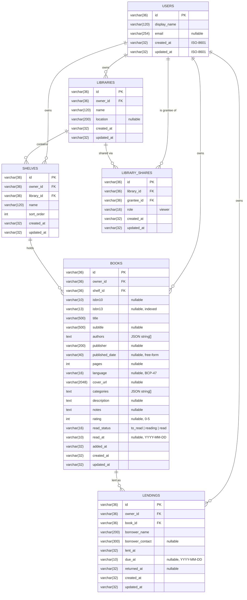

# Data model

Canonical names come from the project brief: **Library → Shelf → Book**, plus
**Lending** and **LibraryShare**. Every aggregate carries `owner_id`; sharing is
modelled from the first migration so multi-user arrives without a schema
rewrite.

## Notes

- **Ownership.** `owner_id` on libraries, shelves, books and lendings is
  denormalised on purpose: every repository query filters by owner without a
  join, and a future multi-user API can enforce tenancy in one place.
- **Sharing.** `library_shares(library_id, grantee_id)` is unique; `role` is
  `viewer` only for now. Read-only sharing means a grantee can list a library's
  shelves and books but never write.
- **Reading state.** `read_status` is one of `to_read`, `reading`, `read`;
  `read_at` is a local calendar day (`YYYY-MM-DD`, no time, no UTC shift) and
  is only ever set when the status is `read`: marking a book read without a
  date stamps today, an existing date survives re-marking, and any other
  status clears it (`resolveReadAt` in `packages/shared`). Future dates are
  rejected by the shared `readAtSchema`, on the API and in the web form alike.
- **Lending.** A lending is open while `returned_at` is `NULL`; the
  `(owner_id, returned_at)` index serves the "what's lent out" list.
- **Deletes cascade** down the hierarchy (user → library → shelf → book →
  lending) so removing a library never leaves orphans.
- **Types are portable.** See [ADR 0002](adr/0002-database-adapter-layer.md)
  for why timestamps and arrays are stored as text.

The authoritative definitions are `apps/api/drizzle/migrations/0001_initial.sql`
(DDL), `apps/api/src/db/schema/*.ts` (Drizzle) and
`packages/shared/src/schemas/*.ts` (Zod, wire format).
