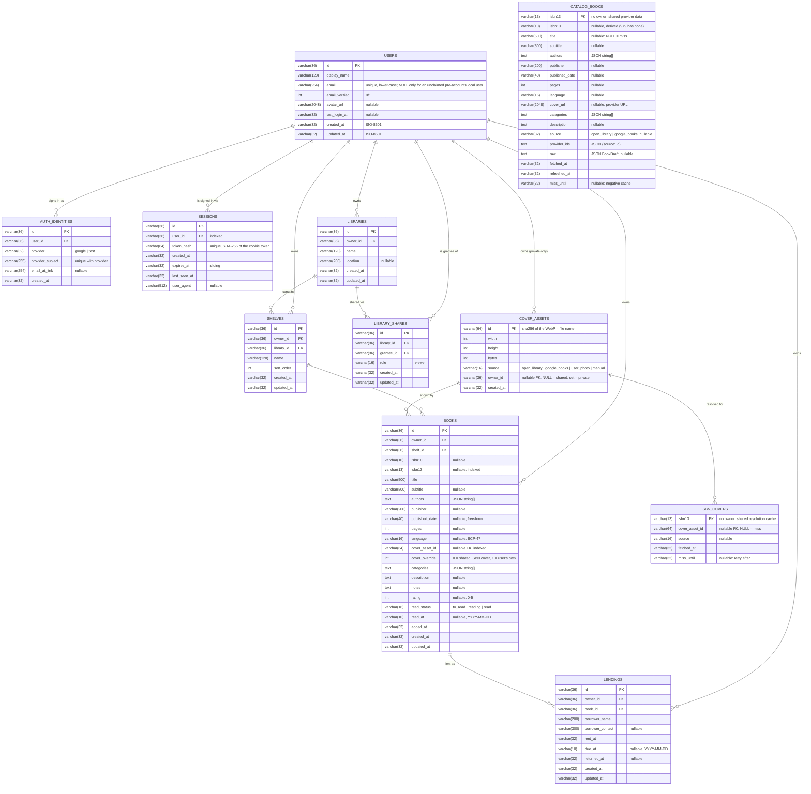

# Data model

Canonical names come from the project brief: **Library → Shelf → Book**, plus
**Lending** and **LibraryShare**. Every aggregate carries `owner_id`; sharing is
modelled from the first migration so multi-user arrives without a schema
rewrite. The owner-less tables are **CatalogBook** — provider metadata per
ISBN-13, shared by every user ([ADR 0003](adr/0003-shared-isbn-catalogue.md)) —
and **IsbnCover**, which maps an ISBN-13 to the shared **CoverAsset** every
book with that ISBN shows ([ADR 0004](adr/0004-cover-assets.md)). Cover images
themselves are files on disk; the tables only describe them.

Accounts ([ADR 0005](adr/0005-authentication.md)): a **User** is one person,
identified by a unique, lower-cased email; **AuthIdentity** rows map a
provider's stable id (Google's `sub`) to that user, and **Session** rows back
the `bg_session` cookie (only the SHA-256 of the token is stored).

## Notes

- **Accounts.** A user is one person and one email (`users.email`,
  lower-cased, unique). `auth_identities` holds the provider ids that map to
  that user — a Google `sub` today, other providers later without a schema
  change — and signing in with a new identity whose verified email already
  belongs to a user links to that user instead of creating another. `email`
  is `NULL` only on the local user of a database seeded before accounts,
  until the first sign-in claims it. `sessions` stores the SHA-256 of the
  cookie token, never the token; rows expire (sliding) and are purged daily.
- **Ownership.** `owner_id` on libraries, shelves, books and lendings is
  denormalised on purpose: every repository query filters by owner without a
  join — reads by id included — so a foreign id is indistinguishable from a
  missing one (`404`, never `403`). Every new account is provisioned with a
  "My Library" library and a "Default" shelf in the transaction that creates
  it (`apps/api/src/provisioning.ts`). See "Isolation between users" in
  [auth.md](auth.md).
- **Shared by design (no `owner_id`).** `catalog_books` (ISBN metadata),
  `isbn_covers` and the shared rows of `cover_assets` (`owner_id` NULL) are
  common to every user: an ISBN's description or cover is not anyone's data.
  `/api/lookup/*` reads and fills that catalogue for whoever is signed in.
- **Sharing.** `library_shares(library_id, grantee_id)` is unique; `role` is
  `viewer` only for now. Read-only sharing means a grantee can list a library's
  shelves and books but never write. No route writes the table yet; the only
  code that reads it is the private-cover check, so today it grants nothing.
- **Account deletion.** `DELETE /api/auth/me` removes the `users` row; the
  foreign keys cascade to sessions, identities, libraries, shelves, books,
  lendings, library shares and the user's private `cover_assets` (whose files
  the API removes right away, since the GC can no longer see the rows). Shared
  covers and the catalogue stay.
- **Reading state.** `read_status` is one of `to_read`, `reading`, `read`;
  `read_at` is a local calendar day (`YYYY-MM-DD`, no time, no UTC shift) and
  is only ever set when the status is `read`: marking a book read without a
  date stamps today, an existing date survives re-marking, and any other
  status clears it (`resolveReadAt` in `packages/shared`). Future dates are
  rejected by the shared `readAtSchema`, on the API and in the web form alike.
  `rating` is 1–5 (`NULL` = unrated; the API maps `0` to `NULL`, see
  `normaliseRating`).
- **Re-reads are not modelled yet.** A book carries a single finished date.
  When re-reading matters, add a `book_reads (id, book_id, read_at)` history
  table and keep `books.read_at` as the latest one — no rewrite of the
  existing column is needed.
- **Lending.** A lending is open while `returned_at` is `NULL`; the
  `(owner_id, returned_at)` index serves the "what's lent out" list. A book
  has at most one open lending at a time — enforced by the API inside a
  transaction (`apps/api/src/lending.ts`), not by a constraint, so the rule
  stays portable. `due_at` is a calendar day; "overdue" is derived (open and
  `due_at` before today), never stored.
- **Deletes cascade** down the hierarchy (user → library → shelf → book →
  lending) so removing a library never leaves orphans.
- **Catalogue.** `catalog_books` is filled lazily by `/api/lookup/isbn/:isbn`
  and search results; `books` copies its fields at add time and never
  references it, so a user's edits are theirs alone.
- **Covers.** A cover is a WebP file under `COVERS_DIR/<xx>/<sha256>.webp`
  (+ `-thumb`), never a blob. `cover_assets` names the file by its content
  hash, so identical images are stored once; `owner_id` NULL means "resolved
  from a provider by ISBN, shared by everyone", a user id means "this user's
  photo or pasted URL, served only to them (or a library-share grantee)".
  `isbn_covers` caches ISBN → shared asset (a row with a NULL asset and
  `miss_until` is a cached miss). `books.cover_asset_id` points at the cover a
  book shows and `cover_override` records that the user chose it; the served
  `coverUrl` is computed from the asset id, no URL is stored. Deleting a book
  leaves the file; a GC removes assets nothing references any more.
- **Types are portable.** See [ADR 0002](adr/0002-database-adapter-layer.md)
  for why timestamps and arrays are stored as text.

The authoritative definitions are `apps/api/drizzle/migrations/*.sql`
(DDL, applied in order), `apps/api/src/db/schema/*.ts` (Drizzle) and
`packages/shared/src/schemas/*.ts` (Zod, wire format).
